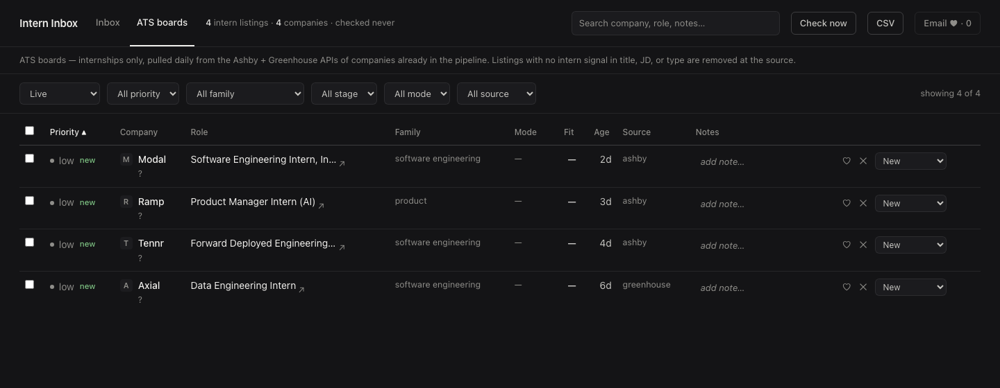

# Intern Inbox

A local, private internship pipeline for NOC New York students. Free keyless
job-board APIs + your own job-alert emails, gated to NYC/NJ internships, triaged
in a local web inbox.



## What it is

Internship listings from a few sources land in one list on your laptop. You mark
each one new, shortlisted, applied, or dead. Nothing else. It only keeps
**internships** in **New York City and New Jersey** — everything else is dropped
before it reaches you.

## Requirements

- A Mac. Windows works too — see [SETUP.md](SETUP.md).
- A [Claude Code](https://claude.com/claude-code) subscription. Setup is a
  conversation with Claude Code, so this is required, not optional.
- About 15 minutes.

## Quickstart

Paste this one command into Terminal (it installs what's missing, downloads the
project to `~/intern-inbox`, and sets it up):

```bash
curl -LsSf https://raw.githubusercontent.com/osaidd/intern-inbox/main/bootstrap.sh | sh
```

Then open the `intern-inbox` folder in Claude Code (File → Open… → your home
folder → intern-inbox) and type:

```
/setup
```

Claude asks about the roles you want, reads your resume, writes your config,
and walks you through connecting your email. At the end it runs a first pull
and opens the app at http://127.0.0.1:8477.

If `/setup` isn't recognized, Claude Code is looking at the wrong folder — open
the `intern-inbox` folder itself, not your home folder or Desktop. And run it in
Claude Code on your own computer (not a claude.ai cloud session — those can't
reach the job boards).

After that, the daily loop is: open the app, press **Check now**, triage the new
rows. Run `git pull` now and then to pick up boards other students added.

Prefer doing the steps by hand? Install [uv](https://docs.astral.sh/uv/) first
(`curl -LsSf https://astral.sh/uv/install.sh | sh`), then
`git clone https://github.com/osaidd/intern-inbox.git && cd intern-inbox && uv sync`
— full walkthrough in [SETUP.md](SETUP.md).

## What it pulls

| Source | What you get |
|---|---|
| Ashby + Greenhouse posting APIs | 65 NYC company job boards, shared by the whole cohort, swept once a day |
| Your job-alert emails | LinkedIn, Built In, and Wellfound alerts, read from your Gmail inbox |
| SimplifyJobs GitHub lists | The big public internship lists |
| Indeed + Google, via JobSpy | Broader board search on your target titles |

Job descriptions are saved alongside the listing — straight from the board where
the source provides them, fetched afterwards where it does not — so search
actually works and most rows need no second tab.

## Privacy

Everything stays on your machine.

- The database is a single SQLite file in `data/`. The app is a web page served
  from your own laptop at `127.0.0.1:8477`.
- No telemetry, no analytics, no account to create, no server to sign in to.
- Your resume, your profile, and your config are gitignored. They cannot be
  committed by accident.
- LinkedIn is never scraped. LinkedIn postings only arrive through the alert
  emails you subscribe to yourself.
- The board APIs are public and keyless. Requests go out one at a time, about a
  second apart, with an honest user agent that names the project and your own
  contact address.

## Contributing a board

Found a company hiring on Ashby or Greenhouse that is not in the list yet? Add
its board slug to `config/sources.toml` and open a pull request. The whole
cohort picks it up on the next `git pull`.

The slug is the company name in the board URL:

```
https://jobs.ashbyhq.com/modal          -> ashby slug:      modal
https://job-boards.greenhouse.io/axial  -> greenhouse slug: axial
```

Add it to `ashby_orgs` or `greenhouse_orgs` under `[ats]`, keep the list
alphabetical, and that is the whole change.

Boards you would rather keep to yourself — a company you do not want to tip off
the group about, or a private link — go in `config/sources.local.toml` instead.
That file is gitignored and merges over the shared one. Never put your own
config, resume, or email in a pull request.

## macOS extra (optional)

`automation/install-intern-inbox-app.sh` builds an "Intern Inbox" app in
`~/Applications` that starts the server and opens the inbox in one click. Pass
`--dock` to pin it. You never need it — `uv run intern-inbox` does the same
thing from a terminal.

## License

MIT. See [LICENSE](LICENSE).
