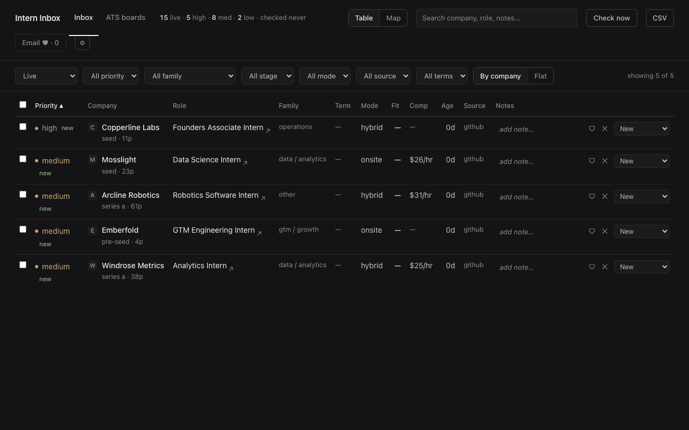

# Intern Inbox

[](https://github.com/osaidd/intern-inbox/actions/workflows/ci.yml)
[](LICENSE)
[](https://www.python.org/downloads/)

A local, private internship pipeline for **NYC/NJ internships**. Company job
boards + your own job-alert emails, triaged in one inbox on your laptop.



## Quickstart

**Mac** — paste into Terminal:

```bash
curl -LsSf https://raw.githubusercontent.com/osaidd/intern-inbox/main/bootstrap.sh | sh
```

**Windows** — paste into PowerShell:

```powershell
irm https://raw.githubusercontent.com/osaidd/intern-inbox/main/bootstrap.ps1 | iex
```

The app opens in your browser with a 3-step setup. That's the whole install.

Either paste installs what is missing, downloads the project to
`~/intern-inbox`, and starts it. The three steps ask which roles you want, how
big a company you will consider, and — optional — a Gmail app password so the
app can read your job-alert emails. Answer them and the first pull runs.
(Already have Claude Code? The paste opens the project there instead — see
[SETUP.md](SETUP.md).)

After that the loop is: open the app, press **Check now**, triage the new rows.
Run `git pull` now and then to pick up boards others have added.

The Windows script has been read line by line but never run on a real Windows
machine. First Windows tester welcome: if it stops early, open an issue with
what it printed.

The long version, with troubleshooting: [SETUP.md](SETUP.md).

## What it is

Internship listings from a few sources land in one list on your laptop. You mark
each one new, shortlisted, applied, or dead. Nothing else. It only keeps
**internships** in **New York City and New Jersey** — everything else is dropped
before it reaches you.

## Requirements

- A Mac or a Windows machine.
- About 10 minutes.

### Recommended: Claude Code

Nothing above needs [Claude Code](https://claude.com/claude-code) — the setup
wizard, the feeds, and the inbox all run without it. What it adds: open the
`intern-inbox` folder in it and `/setup` reads your actual resume and rewrites
your keywords and rankings from it, which goes deeper than the starter bundles
the wizard picks from your checkboxes. Once you have real rows,
`/opportunity-scan`, `/skills-gap`, and `/pipeline-review` do the rest —
[what each one does](#after-a-week-of-data).

## What it pulls

| Source | What you get |
|---|---|
| Ashby + Greenhouse posting APIs | The shared list of NYC company job boards, swept once a day |
| Your job-alert emails | LinkedIn, Built In, and Wellfound alerts, read from your Gmail inbox |
| SimplifyJobs GitHub lists | The big public internship lists |
| Indeed + Google, via JobSpy (optional) | Broader board search — off by default; `uv sync --extra jobspy` turns it on |

Job descriptions are saved alongside the listing — straight from the board where
the source provides them, fetched afterwards where it does not — so search
actually works and most rows need no second tab.

## Privacy

Your data stays on your machine: the database is a local SQLite file, the app
runs on localhost, there are no accounts and no analytics.

To be precise about what does leave your machine: the feeds call the public
Ashby/Greenhouse/SimplifyJobs/Indeed APIs to fetch listings (board requests
carry your contact email in an honest user-agent so employers can reach you
about traffic — posting-page fetches use a neutral one); company logos load
from Google's favicon service and the map (once offices are geocoded) loads
OpenStreetMap tiles, so those services see ordinary page-load requests. Your
resume, profile, config, and pipeline never leave your machine. Resume files
(`*.pdf`, `*.docx`) are gitignored so `git add -A` can never stage them.

## After a week of data

The daily list is half the product. Once your database has real rows, open the
folder in Claude Code and use:

- **/opportunity-scan** — full sourcing sweep + company enrichment (stage,
  size, office) that upgrades row priorities from "medium/low" to real tiers.
  Run this early: it is what makes the priority column meaningful.
- **/skills-gap** — reads every stored JD against your profile: what the
  market demands, where you fall short, and per-role fit briefs.
- **/add-opportunity** — paste any posting/URL/alert email to file it.
- **/pipeline-review** — triage by talking: "kill 12", "applied to Ramp".

Got a new resume? Open the folder in Claude Code and say **"update my
resume"** — it shows you how your keywords and rankings will change before
writing anything. The resume file itself is gitignored: it is read locally and
never leaves your machine.

## Contributing a board

Found a company hiring on Ashby or Greenhouse that is not in the list yet? Add
its board slug to `config/sources.toml` and open a pull request. Everyone else
picks it up on the next `git pull`.

The slug is the company name in the board URL:

```
https://jobs.ashbyhq.com/modal          -> ashby slug:      modal
https://job-boards.greenhouse.io/axial  -> greenhouse slug: axial
```

Add it to `ashby_orgs` or `greenhouse_orgs` under `[ats]`, keep the list
alphabetical, and that is the whole change. Not up for a pull request? Open a
GitHub issue with the board URL instead (there's a template) — no fork needed.

Boards you would rather keep to yourself — a company you do not want to tip off
the group about, or a private link — go in `config/sources.local.toml` instead.
That file is gitignored and merges over the shared one. Never put your own
config, resume, or email in a pull request.

## macOS extra (optional)

`automation/install-intern-inbox-app.sh` builds an "Intern Inbox" app in
`~/Applications` that starts the server and opens the inbox in one click. Pass
`--dock` to pin it. You never need it — `uv run intern-inbox --open` does the
same thing from a terminal.

## License

MIT. See [LICENSE](LICENSE).
